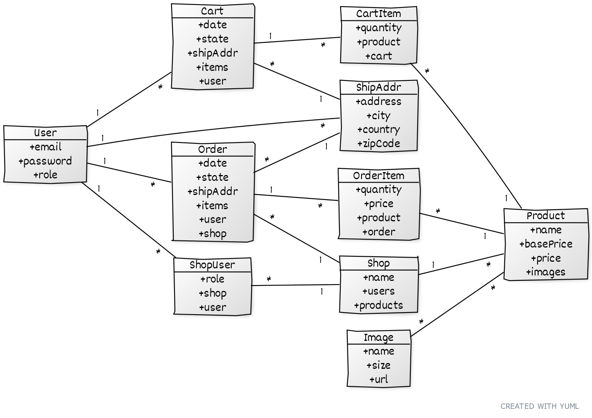

# Marketplace API 

## Marketplace API Specification 
In this example contains core feature of the Marketplace API. The APIs separated into groups of functionalities with specification below. 

* User Management  `/api/users`
  * Anyone free to register using email, password and name. 
  * User restricted only can modify and delete their own user data. 
  * Email restricted only visible to the user itself anywhere on the API response. 
  * List of users only accessible by Admin.
  
* Shop Management `/api/shops`
  * Any registered user can create shop. 
  * User who created the shop assigned as the Shop Owner by default. 
  * User allowed to create multiple shops as they like. 
  * Only Shop Owner can modify and delete the shop data. 
  * Any login user should able to see list of all shops.

* Shop User Management `/api/shops/{pid}/users`
  * Shop Owner can add more user to the shop as staff. 
  * A Shop Staff has limited access to the shop. 
  * Shop user list not accessible by non shop user.
  
* Shop Product Management `/api/shops/{pid}/products`
  * Shop Owner and Shop Staff able to add new, modify and delete product. 
  * Product contains multiple images. 
  * Product base price only visible by Shop Owner and Shop Staff but not visible to other user.
  
* Image Management `/api/images`
  * All users has access to upload images but maximum size allowed is 5 MB. 
  * List of all images only accessible by Admin.
  
* User Shipping Address Management `/api/users/{pid}/shipping-addresses`
  * All user can have multiple shipping address. 
  * Only the owner of the data can view, modify and delete the shipping address.
  
* Products List `/api/products`
  * All users able to see all products, products contains information about price, picture and the appropriate shop. 
  * User can add the product later into their shopping cart.
  
* Shopping Cart `/api/carts`
  * All users has shopping cart. 
  * Shopping cart automatically created and kept open until closed (checked out). 
  * Products from multiple shops can be added to shopping cart item. 
  * When the same product added, it automatically merged and increase the quantity. 
  * Shopping cart item can be modify and deleted. 
  * Shopping cart items grouped based on shop. 
  * Closed shopping cart can't be modified nor deleted. 
  * A new shopping cart created after checkout process done.
  
* Shop Order Management `/api/shops/{pid}/orders`
  * Showing list of user's orders related to shop. 
  * Only accessible by the Shop Owner and Shop Staff. 
  * Order is immutable except the state. Available state values for shops are Prepared and Sent.
  
* User Order Management `/api/users/{pid}/orders`
  * Showing list of user's orders. Only accessible by the owner of the data. 
  * User only can set the state value of the order. 
  * Available state values for users are Received and Issue.

## Entity Relationship Diagram 
As a reference, here is the Entity Relationship Diagram of the database tables used by Marketplace API.

